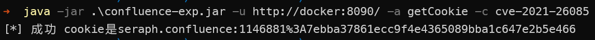
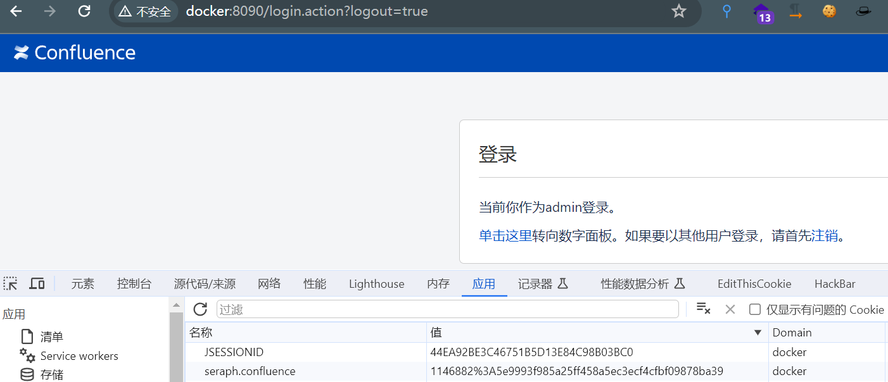
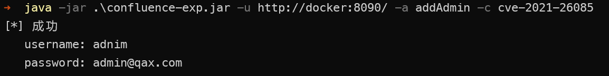
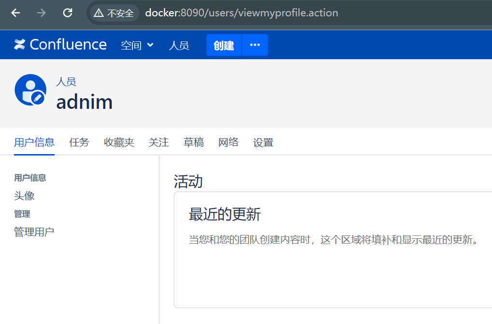
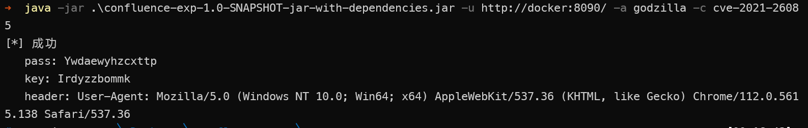
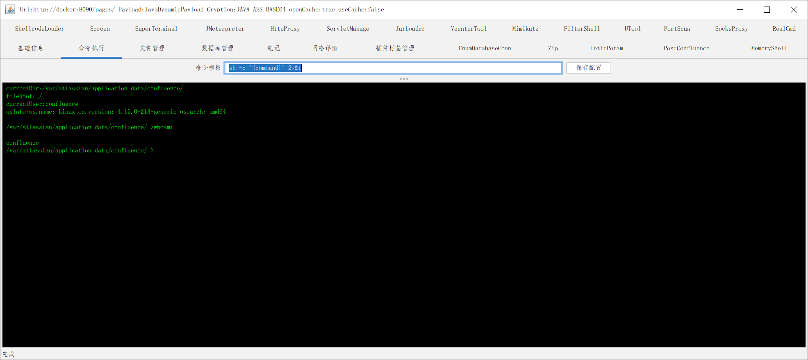
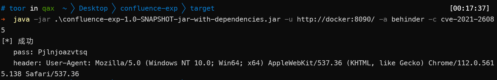
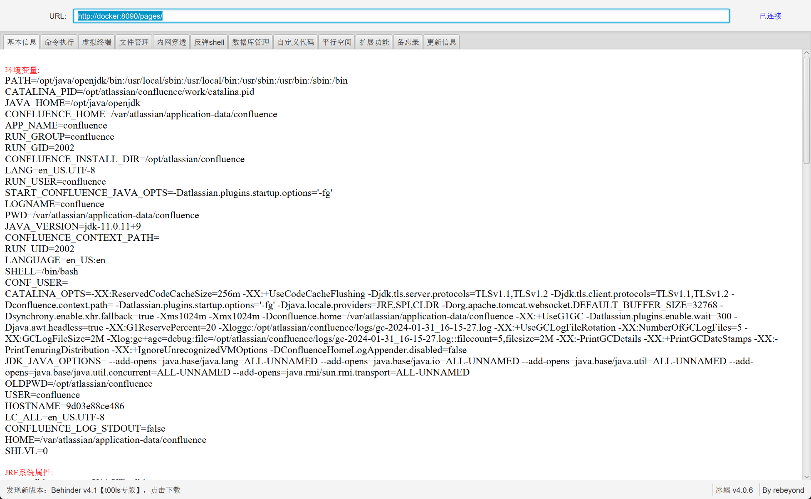
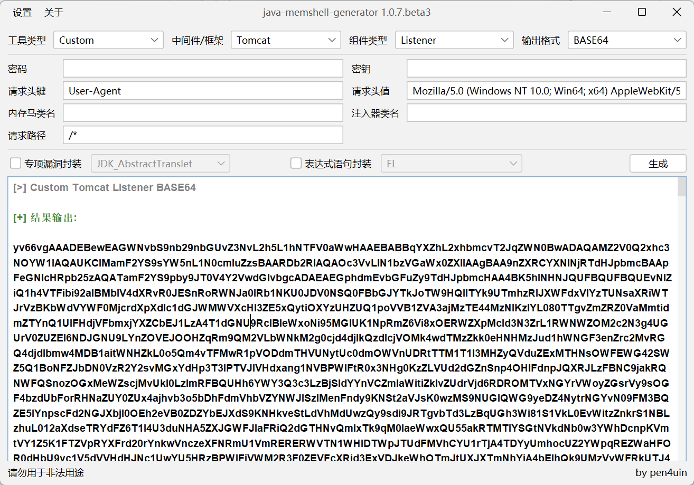
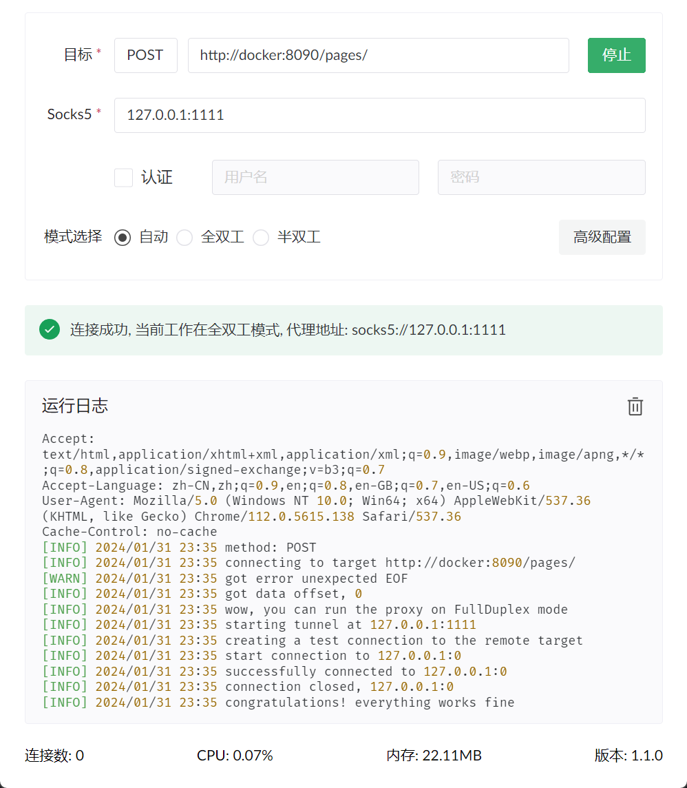

# confluence

## 已定义的功能

* 暂时支持cve-2021-26085 和 cve-2022-26134,
* CVE_2023_22515，CVE-2023-22527 过年再看下

支持直接写入冰蝎、哥斯拉内存马

支持不写shell直接获取管理员cookie、添加管理员

支持执行自定义字节码

## 用法

例： java -jar confluence-exp.jar -u http://127.0.0.1:8090/ -a godzilla -c cve-2021-26085

-a 可选 behinder,godzilla,custom,addAdmin,getCookie

-c cve-2021-26085, cve-2022-26134, 2023(还没看，看完写)

自定义字节码指定 -i 字节码文件路径  -cl 字节码的class

增加cookie登录

新增管理员

adnim/admin@qax.com

打入哥斯拉

打入冰蝎

## 自定义字节码

注入一个suo，首先用jmg生成一个suo的filter字节码

-i 文件路径  -cl 指定 `注入器类名`

还可以有其他玩法，比如添加用户和获取cookie的实现就是先打入一个方法类到内存，在反射调用，可参考PostConfluence实现

